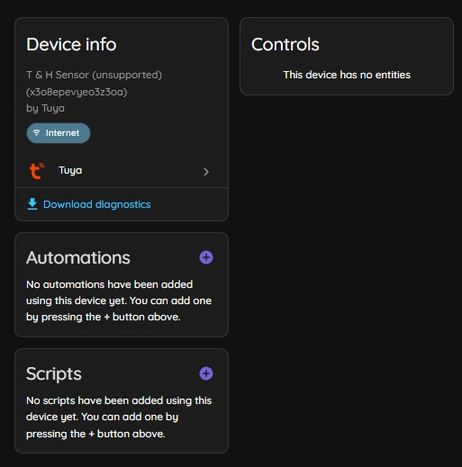
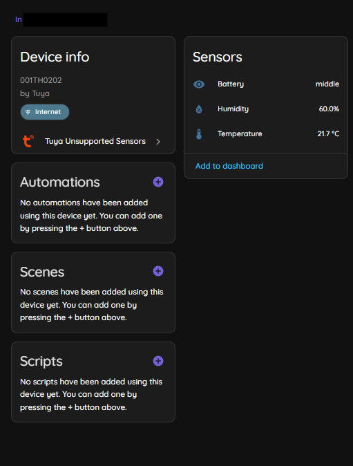

# Tuya Unsupported Sensors

This intergration will continue to support already mapped devices from previous feature requests. Otherwise, see below. 

## Tuya Quirks as of 2026.5.0
With Home Assistant core release 2026.5.0, Tuya quirks now enable users to edit, add, and map datapoints so their device is supported in the core intergration. That means that this custom intergration will be uneeded in the future once all the datapoints have quirks. 

To help with the creation and collection of quirks for public use (🎉), please help out by doing the below instructions for any devices that are missing entities in the core Tuya intergration. You can put all the below info in an issue in [tuya-device-handlers](https://github.com/home-assistant-libs/tuya-device-handlers/issues) where some people like myself will help make a quirk. Once you've tested it and confirmed it works, a pull request can be created and hopefully merged to be used in the next core release. Then, you'll be able to use your device using the core intergration!

### Contribute details for a quirk
Make an issue (template Feature Request) in the issues tab of [tuya-device-handlers](https://github.com/home-assistant-libs/tuya-device-handlers/issues) with the following debugging responses.

#### Tuya Dev Debug  (don't have an account? see [tutorial](https://github.com/kattcrazy/Tuya-Unsupported-Sensors#tuya-developer-api))
1. Go to https://platform.tuya.com/ > cloud > project management > open project > devices
2. Find your device and copy its ID
3. Go to https://platform.tuya.com/cloud/explorer > device control > query properties
4. Paste your device's ID and submit

When sharing this, please don't share the request url as it contains sensitive parameters.

#### Home Assistant Diagnostics
1. Go the the **core** Tuya integration in your installation- **not** this intergration
2. Navigate to your unsupported device
3. Click download diagnostics
4. Paste the diagnostics in the issue (don't upload the file if possible)

### Testing a quirk

1. Make the folder `<config>/tuya_quirks/` in your Home Assistant directory
2. Place the provided quirk file in that location, keeping the name the same 
3. Reload the core Tuya intergration
4. Check your device for entities and confirm if they are correct

### Tuya Developer API
Follow [this guide](https://github.com/azerty9971/xtend_tuya/blob/v4.2.4/docs/cloud_credentials.md) until step 5 to see how to set up the API credentials
> Thanks to [@azerty9971](https://github.com/azerty9971) for the thorough guide

---

## Pre-Quirk Intergration Information

This is an intergration that creates devices & entites for sensors otherwise unsupported by the main tuya/smart life intergration. Unlike Tuya Local and Local Tuya, this uses the cloud-based API.

> This intergration supports mappings for read-only sensors, as manging controls far exceeds my/AI's skill level. However, the core Tuya intergration can read and write. 

| Core Tuya | Tuya Unsupported Sensors |
|-----------|--------------------------|
|  |  |

## Install

## Troubleshooting

### Trouble finding devices/incorrect API key

- Has your API key expired?
- Have you followed the steps above?

### Trouble finding devices

- Do you have devices in your Smart Life/Tuya app/account?
- Have you followed the steps above?

### No entities in a device/unsupported/missing data

Refer to [the guide](https://github.com/kattcrazy/tuya_unsupported_sensors?tab=readme-ov-file#request-a-new-sensorentity) on how to find the debugging response. Create an issue with that response and I will add the mappings for your entities. 

### Error 1010 (Token Invalid)

Tuya API access tokens expire after approximately 2 hours, and the integration automatically refreshes tokens when this happens. If the issue persists, verify your API credentials are correct and create an issue containing your logs.

### Sensors updating too slowly or rate limit errors

Please calculate your minimum update interval using the following equation to avoid rate limiting or running out of api calls. ` 99.69 x Number of Devices = Minimum update interval `

### Discovery_failed error

There are two possible causes. One, you are using the wrong datacenter. Two, your Iot Core free trial has expired and you need to extend it. To check, do the following.

1. Download and run [Datacenter_test.py](https://github.com/kattcrazy/tuya_unsupported_sensors/blob/main/Datacenter_test.py). It will ask for your Tuya API details and then return the results of each different datacenter.
2. If there is a working datacenter, that's the one that your Tuya API Project needs to use. If your API project not using that, please remake your Tuya cloud project following [these](https://github.com/kattcrazy/tuya_unsupported_sensors?tab=readme-ov-file#tuya-developer-api) steps.
3. If all the datacenters fail, look for one that says "No permissions. Your subscription to cloud development plan has expired". To renew your Tuya IoT Core (which is what you need for this), go to https://www.tuya.com/vas/commodity/IOT_CORE_V2 and click "Buy now". It'll take you to a page where there should be a button to apply for a extension. I use the following details or similar when applying, and so far I haven't been denied.

## License

This project uses the [GNU General Public License v3.0](https://www.gnu.org/licenses/gpl-3.0.html). See [LICENSE](LICENSE) for the full legal text. In short: you can use, change, and share it freely. If you distribute a modified version, you must offer it under the same license and share the source too, so the work (and its derivatives) stay open. You cannot take this code, tweak it, and ship it as a closed product.

## About
This is my first github repo and my first time making a Home Assistant intergration. Originally a python script, I have tested it on my own setup and it works well! Please report an issue if something doesn't work, I'll try my best to fix it. Contributions/PRs welcome. 

If this helps you out a heap or you appreciate my work in adding quirks, consider supporting me [here](https://kattcrazy.nz/product/support-me/) :)
